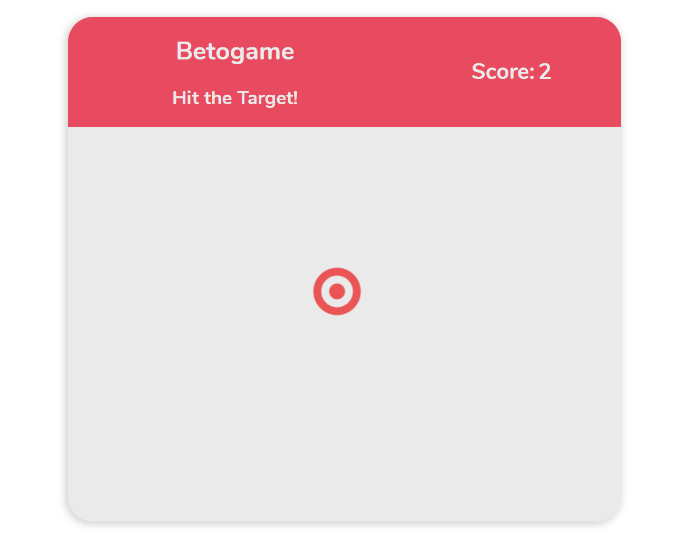

# Target Game

Simple hit the target game made with plain JavaScript.

## Preview

### How it works

Target has a random position that changes every 0.8 - 1.3s. 1 point for a hit, -1 point for a miss.

### Future implementations

- 3 levels of difficulty (target sizes and speed); (Done)
- Target instantly changes position when hit;
- Different scoring for each part of the target. (Done)
