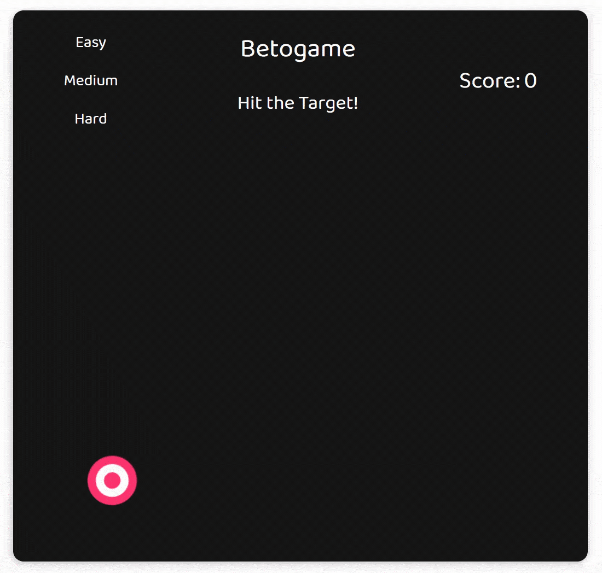

## 🎯 Target

Simple hit the target game made with plain JavaScript.

### 📺 Preview

### 🖱 How it works

Hitting the center of the target grants you 3 points, the white part 2 points and the outter part 1 point, if you miss the points are reset. The target moves randomly and it's speed and size changes according to the difficulty.
obs: Hitting the center of the target awards the same amount of points in easy, medium and hard.

### 🛠️ Future implementations

- 3 levels of difficulty (target sizes and speed); ✅
- Target instantly changes position when hit;
- Different scoring for each part of the target. ✅
